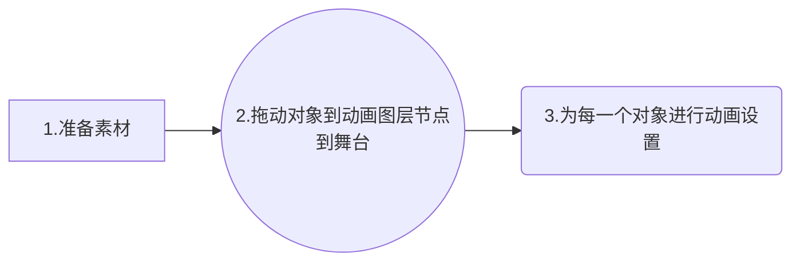

# Flutter flare学习

#### Flare我们有图有视频有文章。没有学不会，只要你动手了，再难也会搞出来。

> ##### 一，At its most basic level, Flare is a 2D animation program. It allows you to place objects on the stage and animate their properties (e.g. position, scale, rotation).[官方文档](https://docs.2dimensions.com/support/flare/core-concepts)

---
##### 一.概念:Flare官方也说到它就是一个能让各种对象在舞台上进行各种缩放，移动，旋转等操作....的2D动画程序。对于Flare我花费了一个上午，从阅读官方和自己写动画过程，当然了素材是自己写之前准备的,只需一个早上搞的明明白白。

>  我们看Flare编译器就明白了:如下图01就是所谓的舞台,然后我们可以在这个舞台中央进行基本图像(shape)和Pen(画笔)，骨骼，点....等对象的操作。在不同的时间点进行对对象设置(旋转,缩放,位置变动,透明度...)，最后进行补间动画过渡。从而达到我们所要的效果。
>  

#### 二.制作步骤:

**那个说一小时搞定的.....** 

##### 1.准备素材：
> 你要成为一个专业且高端的动画制作者,首先明白素材的获取(你得学会PhotoShop?加些3Dmax....等这个我在大学学过)。那些看到的b真的动画，头发飘逸，小兔子甩起来，大眼睛眨一眨的......如何让你的图片的每一个部分动起来。首先需要你的素材的各个部位抠出来,对把下面这个小姑凉大卸八块。你喜欢的地方都切下来作为素材。 

###### 下图哪些地方动起来了：将每一个部位利用套索或者魔术棒工具搞出来，作为多个图层。因为这些部分我要她动起来。在Flare里面下面5个部位图层作为5个对象，将在Flare舞台上进行设置动画效果。最终动起来了。这里我PS获取步骤就不在博客里面写了，具体的可以看看视频。
1.头发。
2.一眨一眨的眼睛。
3.颤动的两个小兔子。
4.摇摆的尾巴。
5.扭动的身体

最后我们将photoShop中的文件保存为PSD格式作为素材保存到电脑。

##### 2.拖动对象到动画图层节点到舞台
打开[Flare制作网站](https://www.2dimensions.com)点击右上角Rigest注册，然后登录。看到如下图编辑界面。

界面序号：
 1,切换设计部分
 2,切换动画部分
 3,动画时间轴
 4,这就是展示动画的舞台

左下脚点击加号导入素材:
1，这部分将管理动画素材的。
2.这里的素材库，我们可以通过拖动2里面的素材到1的节点下。

开始新建图层节点:操作如下，点开图形对象，将骨骼放入屏幕中差不多头发的位置，再将头发拖入到骨骼节点下。通过旋转，缩放，位置等调整位置。

同样的方式将所有的身体部分拖动到舞台。如下

最后我们给每一个节点设置不同时间下的状态(旋转，缩放,位置等)。。。

同样的方式为每一个节点添加不同的时间动画。最终效果如下：

